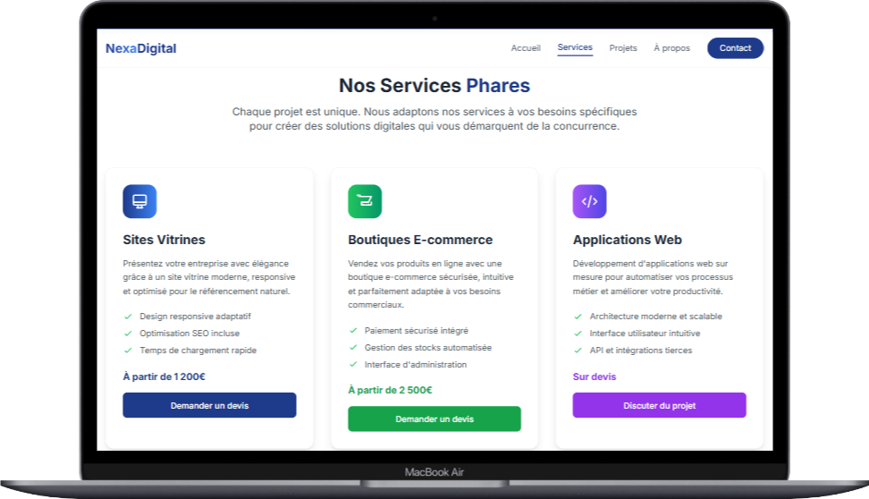
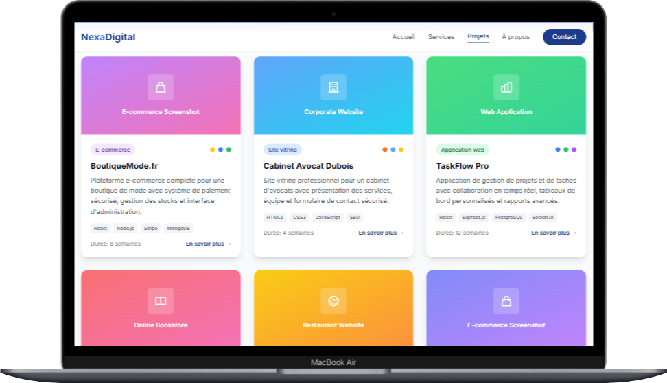
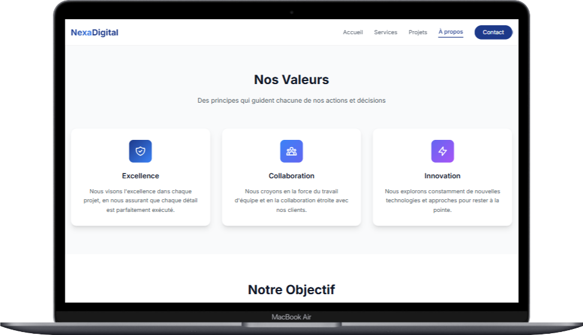
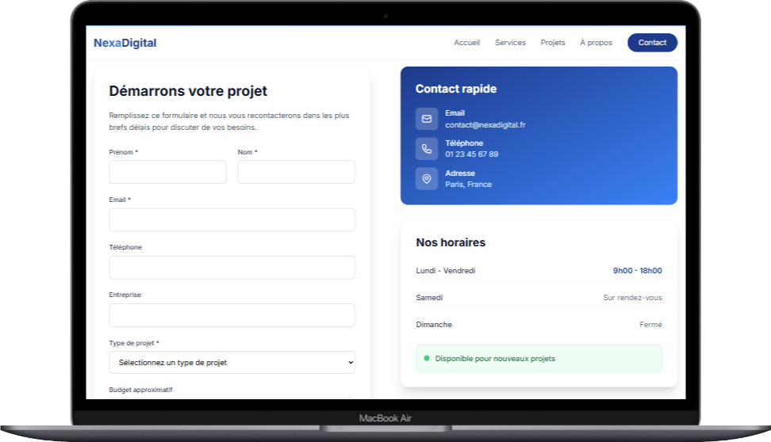
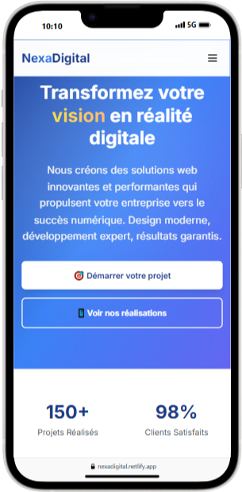

# NexaDigital - Site Vitrine d'Agence Web Fictive

Ce dépôt contient le code source du site web statique pour **NexaDigital**, une agence de développement web fictive. Ce projet a été conçu comme une pièce maîtresse de portfolio pour démontrer des compétences en développement frontend, incluant la maîtrise de **HTML5**, **TailwindCSS** et **JavaScript (Vanilla JS)** pour créer une expérience utilisateur riche et moderne.


## ✨ Fonctionnalités Principales

* **Site multi-pages** : 5 pages complètes et cohérentes (Accueil, Services, Projets, À propos, Contact).
* **Design 100% Responsive** : Une expérience utilisateur optimale sur tous les appareils, du smartphone à l'écran large, grâce à une approche *mobile-first*.
* **UI/UX Moderne** : Des animations CSS subtiles à l'apparition des éléments (`IntersectionObserver`), des effets de survol interactifs et des transitions fluides.
* **Portfolio Interactif** : Une grille de projets sur la page `projects.html` avec un système de filtrage dynamique par catégorie, entièrement réalisé en Vanilla JS.
* **Composants Réutilisables** : Une structure de composants cohérente (boutons, cartes, sections) grâce à la philosophie de TailwindCSS.
* **Formulaire de Contact** : Un formulaire complet avec des validations basiques côté client pour une meilleure expérience utilisateur.

---

## 🛠️ Technologies et Outils

Ce projet a été volontairement construit sans "build tools" (Webpack, Vite...) ni frameworks JS complexes pour se concentrer sur la maîtrise des technologies web fondamentales.

* **HTML5** : Pour une structure sémantique, propre et accessible.
* **TailwindCSS** (via CDN) : Pour un prototypage et un design rapides, responsives et personnalisables directement dans le HTML.
* **JavaScript (Vanilla JS)** : Utilisé pour toutes les interactions dynamiques:
    * Gestion de l'affichage du menu mobile (hamburger).
    * Animations au défilement via l'API `IntersectionObserver`.
    * Logique de filtrage des projets par catégorie.
    * Logique d'affichage/masquage pour l'accordéon de la FAQ.
    * Simulation d'envoi de formulaire sur la page contact.
* **Google Fonts** : Utilisation de la police **Inter** pour garantir une typographie moderne et très lisible.
* **Heroicons** : Icônes SVG utilisées dans tout le site pour une interface claire et légère.

---

## 📂 Architecture du Projet

La structure des fichiers est simple et intuitive, idéale pour un site statique facile à maintenir et à déployer.

```
nexadigital/
├── index.html          # Page d'accueil
├── services.html       # Page de présentation des services
├── projects.html       # Page du portfolio avec les réalisations
├── about.html          # Page "À propos de nous"
├── contact.html        # Page de contact avec le formulaire
└── README.md           # Ce fichier
```

---

## 🚀 Déploiement

Le site est actuellement déployé sur Netlify et accessible à l'adresse : [https://nexadigital.netlify.app/](https://nexadigital.netlify.app/)

### Fonctionnalités du déploiement
- ✅ HTTPS automatique
- ✅ CDN global
- ✅ Déploiement continu depuis GitHub
- ✅ Performance optimisée

---

## 📸 Captures d'Écran

### Page d'Accueil

> La page d'accueil présente notre agence avec une section hero accrocheuse et nos services principaux.

### Page Services

> Découvrez notre gamme complète de services de développement web et digital.

### Page Projets

> Explorez notre portfolio de réalisations et nos projets clients.

### Page À Propos

> Apprenez-en plus sur notre histoire, notre équipe et nos valeurs.

### Page Contact

> Contactez-nous facilement via notre formulaire interactif.

### Version Mobile

> Une expérience utilisateur optimale sur tous les appareils.

---

## 🎨 Design et Guide de Style

Le design a été conçu pour être professionnel, épuré et engageant, en accord avec l'image de marque d'une agence digitale moderne.

* **Palette de couleurs**:
    * `Bleu foncé (Nexa-Blue)` : `#1E3A8A` (utilisé pour les textes importants, les fonds et les éléments d'UI principaux).
    * `Bleu clair (Nexa-Light-Blue)` : `#3B82F6` (utilisé pour les liens, les boutons et les dégradés).
    * `Accent (Nexa-Accent)` : `#6366F1` (utilisé pour les CTA et les éléments visuels forts).
    * `Arrière-plan` : `#FFFFFF` et `Gris clair` (`#F3F4F6`) pour des sections bien distinctes.

* **Typographie**:
    * Famille de police : **Inter** (importée depuis Google Fonts), utilisée pour les titres et le corps du texte afin d'assurer une excellente lisibilité.

---

## 🔮 Améliorations Futures

Ce projet constitue une base solide qui peut être étendue de plusieurs manières :

* **Backend & Dynamisme** : Transformer ce site statique en une application web dynamique, par exemple avec **Django** (comme prévu dans l'objectif initial), pour gérer les projets et les contacts depuis une base de données.
* **CMS Headless** : Intégrer un CMS Headless (comme Strapi, Sanity, ou Directus) pour permettre une gestion facile du contenu (projets, articles de blog, etc.) par un non-développeur.
* **Optimisations** : Mettre en place un processus de build (avec Vite ou Webpack) pour minifier les fichiers CSS/JS et optimiser les images, améliorant ainsi les performances.
* **Formulaire Fonctionnel** : Connecter le formulaire de contact à un service comme Netlify Forms, Formspree ou à un endpoint d'API personnalisé pour recevoir les messages par email.

## 👨‍💻 À propos de l'auteur

**Feke Jimmy** est un développeur web passionné spécialisé dans le développement frontend. Ce projet fait partie de son portfolio personnel pour démontrer ses compétences en développement web moderne.

* **Email**: fjimmyxilson@gmail.com
* **GitHub**: [ThePerformer0](https://github.com/ThePerformer0)

---

## 🤝 Contribution

Les contributions sont les bienvenues ! Si vous souhaitez améliorer ce projet, n'hésitez pas à :

1. Fork le projet
2. Créer une branche pour votre fonctionnalité (`git checkout -b feature/AmazingFeature`)
3. Commit vos changements (`git commit -m 'Add some AmazingFeature'`)
4. Push vers la branche (`git push origin feature/AmazingFeature`)
5. Ouvrir une Pull Request

---

## 📝 Licence

Ce projet est sous licence MIT. Voir le fichier `LICENSE` pour plus de détails.
